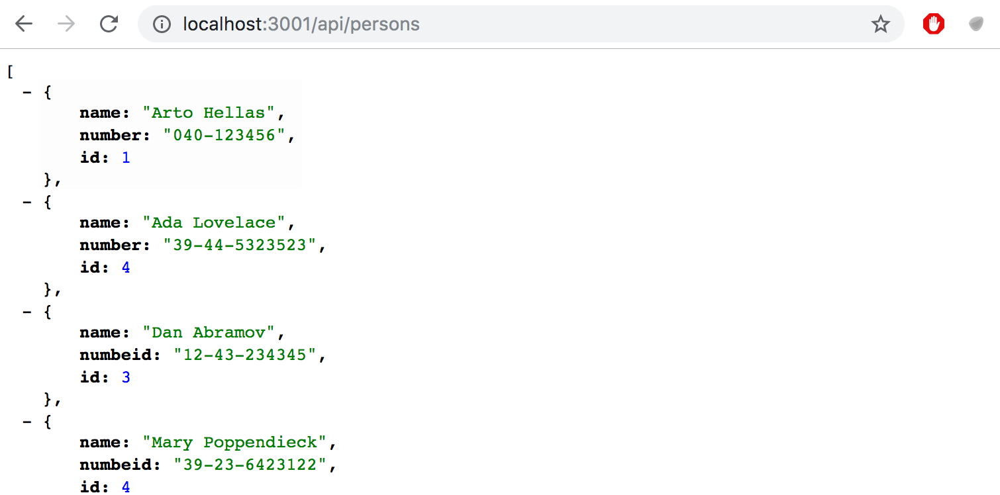
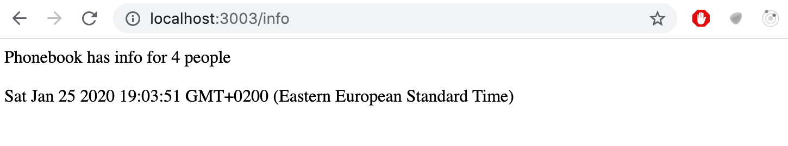

# PHONE BACKEND EXPRESS

### Phonebook backend step1


Implement a Node application that returns a hardcoded list of phonebook entries from the address <http://localhost:3001/api/persons>:




Notice that the forward slash in the route <i>api/persons</i> is not a special character, and is just like any other character in the string. 


The application must be started with the command _npm start_.


The application must also offer an _npm run dev_ command that will run the application and restart the server whenever changes are made and saved to a file in the source code.


### Phonebook backend step2


Implement a page at the address <http://localhost:3001/info> that looks roughly like this:




The page has to show the time that the request was received and how many entries are in the phonebook at the time of processing the request.


### Phonebook backend step3


Implement the functionality for displaying the information for a single phonebook entry. The url for getting the data for a person with the id 5 should be <http://localhost:3001/api/persons/5>


If an entry for the given id is not found, the server has to respond with the appropriate status code.


### Phonebook backend step4


Implement functionality that makes it possible to delete a single phonebook entry by making an HTTP DELETE request to the unique URL of that phonebook entry.


Test that your functionality works with either Postman or the Visual Studio Code REST client.


### Phonebook backend step5


Expand the backend so that new phonebook entries can be added by making HTTP POST requests to the address <http://localhost:3001/api/persons>.


Generate a new id for the phonebook entry with the [Math.random](https://developer.mozilla.org/en-US/docs/Web/JavaScript/Reference/Global_Objects/Math/random) function. Use a big enough range for your random values so that the likelihood of creating duplicate id's is small.


### Phonebook backend step6

Implement error handling for creating new entries. The request is not allowed to succeed, if:
- The name or number is missing 
- The name already exists in the phonebook

Respond to requests like these with the appropriate status code, and also send back information that explains the reason for the error, e.g.:

```js
{ error: 'name must be unique' }
```

### Phonebook backend step7

Add the [morgan](https://github.com/expressjs/morgan) middleware to your application for logging. Configure it to log messages to your console based on the <i>tiny</i> configuration.

The documentation for Morgan is not the best, and you may have to spend some time figuring out how to configure it correctly. However, most documentation in the world falls under the same category, so it's good to learn to decipher and interpret cryptic documentation in any case.


Morgan is installed just like all other libraries with the _npm install_ command. Taking morgan into use happens the same way as configuring any other middleware by using the _app.use_ command.


### Phonebook backend step8


Configure morgan so that it also shows the data sent in HTTP POST requests:


This exercise can be quite challenging, even though the solution does not require a lot of code.


This exercise can be completed in a few different ways. One of the possible solutions utilizes these two techniques:
- [creating new tokens](https://github.com/expressjs/morgan#creating-new-tokens)
- [JSON.stringify](https://developer.mozilla.org/en-US/docs/Web/JavaScript/Reference/Global_Objects/JSON/stringify)

